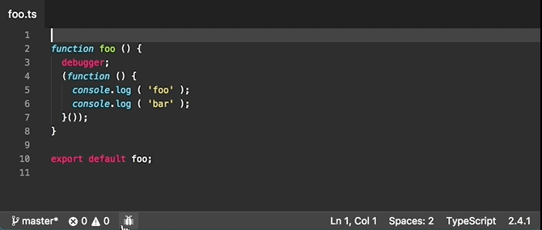

# VSC StatusBar Debugger

<p align="center">
  
</p>

Add a debugger to the statusbar, less intrusive than the default floating one.

## Install

Run the following in the command palette:

```shell
ext install vscode-statusbar-debugger
```

## Usage

It adds 3 new commands to the command palette:

```js
StatusBar Debugger: Toggle // Toggle debugging
StatusBar Debugger: Start // Start debugging
StatusBar Debugger: Stop // Stop debugging
```

It also adds a bug-like icon to the statusbar, you can use it to toggle debugging. Once a debugging session has started the usual actions will appear next to it.

## Settings

```js
{
  "statusbarDebugger.activeColor": "#FFCC00" // The color of the bug icon when active
}
```

## Demo



## Hits:

- **Disable the default debugger**: set `"debug.hideActionBar": true` in your settings to disable the default, intrusive debugger.
- **Remap start/stop shortcuts**: due to some limitations of the API this extension cannot properly detect if you start/stop debugging with other means than those provided by this extension, therefor is advisable to remap your start/stop shortcuts to it (they will work the same, but this extension will be able to detect when they are triggered), add this to your `keybindings.json`:
```json
      { "key": "f5",       "command": "statusbarDebugger.start",
                             "when": "!inDebugMode" },
      { "key": "shift+f5", "command": "statusbarDebugger.stop",
                             "when": "inDebugMode"}
```

## License

MIT © Fabio Spampinato
